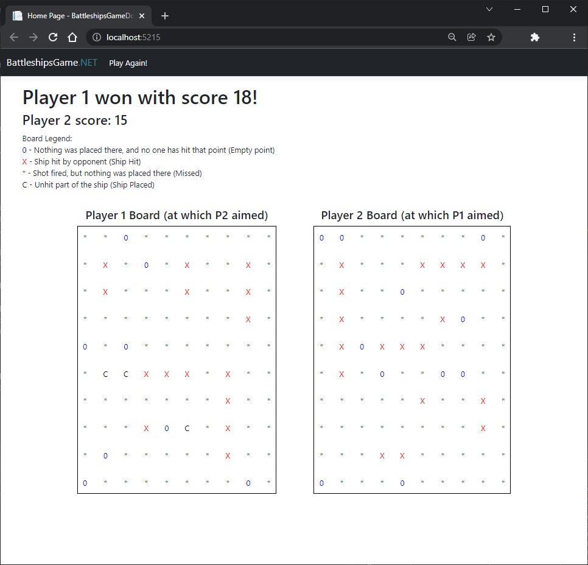

<h1 align="center">
 BattleshipsGameDotNET
</h1>

## Table of contents
* [Introduction](#introduction)
* [Features](#features)
* [Technologies](#technologies)
* [Screenshots](#screenshots)

## Introduction
Web application, which simulates battleships game between two AI players

## Features
* Watch which AI won the game :)
* Currently having only one endpoint, working on WebAPI version with multiple endpoints and ability to see every AI move

## Technologies
* ASP.NET Core
* MVC Pattern
* .NET 6.0
* Bootstrap
* CSS, HTML, JS

## Screenshots

 

